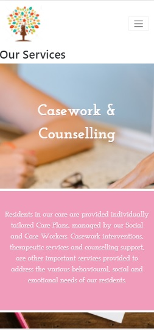
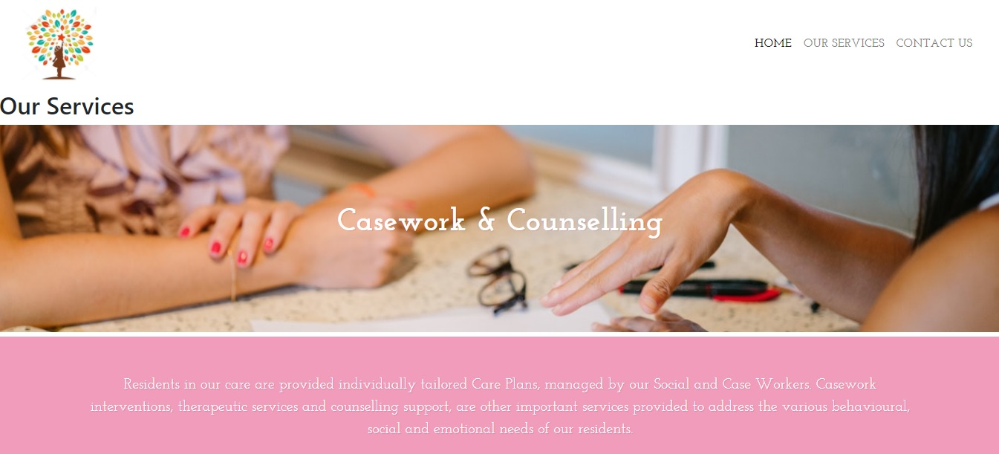

# Sparkle Tree Children Home
This project focuses on the website development for a non-profit society called Sparkle Tree Children Home. The website is a static one. The target audience for this website are the general public. The website’s main objective is to raise awareness about the children home, recruit volunteers and serve as an online donation portal for the home.

Sparkle Tree Children Home is a children home established in 1996. The Society aims to provide a holistic range of residential care, specialized therapy, and psychological services to support and empower the most vulnerable in our community through their challenges of adverse family circumstances, family violence, and child neglect.

Till date, the Society reached out to 28,578 children, youth and families in need.

<a href = index.html>Click here to view Homepage</a>

## Project Strategy
### UX
#### User Stories
1) User would like to read more about the society’s initiatives for the children.
2) User would like to find out about the history of the society.
3) User would like to find out on the services provided by the society.
4) User would like to see the past events held by the society.
5) User would like to contact the society for volunteer opportunity.
6) User would like to donate money to the website.

#### Organization Goals
The society wants to create a website to try to reach out for more volunteers and donations to aid the needy children. As such, the following organization goals have been identified:

1) Organization would like to introduce the Society to website visitors.
2) Organization would like to show visitors the activities and services provided by the Society.
3) Organization would like to allow visitors to sign up as volunteers.
4) Organization would like to allow visitors to made donation to the Society. 

## Project Scope
Based on the user stories and organizational goals identified, these are the following features the website is going to implement:

### Pages/Features
1) Home Page - The Home page consist of 5 pages which contain the main information that the organization wish to bring to the visitors. 
2) Service - The Service page shows the services and activities provided by the organization.
3) Enquiry - The Enquiry page allows the visitors to contact the organization for interest of donation or volunteer.

## Project Structure
### Wire Frame
https://drive.google.com/file/d/1h7-L2EMgEFP5iz_8PZlI4G93xdTsSd7D/view?usp=sharing

## Project Skeleton
### Existing Features
#### (i) Index Page/ Homepage

The index page contains 5 main information that the organization is trying to display to the visitor. The bottom navigation bar will allow the visitors to switch between the 5 information. About Us, Services, Events, Achievement, Contact Us. A Find Out More link is provided to link the visitors to the pages with more detail information.

#### (ii) Services

The services page shows the 3 services offered by the organization. Casework and Counselling, Art & Play Therapy, Family Work & Reintegration. The description of individual services are separated by the background photos. Our Achievement uses numbers to display the effort committed by organization. The event section shows series of photos organized by the society. 

#### (iii) Enquiry

The enquiry has a embedded video to encourage the visitor to donate and volunteer. The video shows the visitors the happiness and fulfillment they got is far more than the help they give. The video was programmed to end before commercial advertisement shown in the end of the video.

A form is provided for the visitors to contact the organization for donation, volunteer opportunity and general enquiry. Visitors are able to select nature of enquiry using the drop down list. The name and email address is necessary for the organization to get back to the visitors, therefore is made compulsory for the submission of the form. Reminder will be prompt to the visitor when it is left blank.

#### (iv) Top and Bottom Navigation bar in Service and Enquiry Page

The top navigation bar consist of the 3 links (About Us, Services, Enquiry) for the visitors to get to individual webpage. To make the site mobile responsive, the 3 links are combined into hamburger menu when the visitor view with mobile device.
The bottom navigation bar consist of the organization address, contact number and email. The organization Social Media links are also provided. As the organization is frictional, the link are not directed to any Facebook and Instagram.

### Features to implement in the future
I wished to add credit card payment services for the donation pages.

## Project Surface

The theme by dodozhang21 used in the home page is chosen as it give visitors a clean and simple layout. The content is modified to fix the theme. The bottom navigation bar display the 5 main information part by part so that the visitor can digest the information better.

#### Colours

Different shades of pink are used to communicate love, peace and kindness to the visitor.

#### Logo

The icon has been taken from Shutterstocks. The rainbow sparkle above the child represent the different dreams that the child is trying to achieve. The overall shape of the logo looks like a tree which fit perfectly to the children home name Sparkle Tree.
The impression I are trying to achieve for the end user is simple and clean layout. End User should be able to retrieve their required information easily.

### Technologies Used

* HTML4.0 and CSS3 were the main language used in this project.
* Bootstrap was used to make the website mobile responsive.
* Cloud9 was used as the IDE for building the website.
* Repository hosted on GitHub

### Libraries

* The icons were taken from Font Awesome.
* The fonts are found in Google Fonts.

### Testing

#### Responsiveness

The website was tested on mobile phone and desktop. In addition, the website was tested using different viewport under the inspector tools. The site is fully responsive - it's mobile, laptop and desktop-friendly.

##### Mobile View

##### Desktop View

#### Browser Compatibility
The application was tested on Firefox and Google Chrome. The site functioned satisfactorily on both browsers.

| Test Case(s)	| Test Description |	Outcome |
|     ---       |       ---        |    ---   |
| 1 |	In the homepage Index.html, the user clicks on bottom navigation bar, the website should display the information accordingly. |	Pass |
| 2	 | In the home page Index.html, the website should re-direct to other web pages (Services,html and Enquiry.html) when the user click on the Find Out More link. |	Pass |
| 3	| In the Services.html, the photos and wording must not overlap each other when display in different platform or display.	| Pass |
| 4 |	In the Services.html, the top navigation bar should show 3 different link and combine into hamburger menu when changes to mobile display. |	Pass |
| 5	| In the Enquiry.html, the video should play when the user click on it. |	Pass |
| 6	| In the Enquiry.html, user should be able to fill up their particular in the form and click on the Submit button.	| Pass |
| 7	| In the Enquiry.html, a reminder will be display if the user forgets to fill in their name and email address. |	Pass |
| 8	| The website should goes back to the homepage Index.html when the user clicks on the Logo on the top left corner. |	Pass |
| 9	| All the website layout should be mobile responsive and follow the layout as stated in the wireframe.	| Pass |

#### Problems Encountered/Bugs solved

* The embedded video in enquire do not show initially. The /embed/ is added before the video id to resolve the issue. The embedded video has advertisement in the end which I do not wish to show. ?start=0&end=175 is added to fixed the start and end time of the video. 
* Both solutions are found in stackoverflow.

## Deployment

This project was written using AWS Cloud IDE and deployed to GitHub.

1. At the start of the project, I created my first index.html file in Cloud9.
2. Next, I opened a new terminal and type in the git init command to initialize a local repository.
3. A new remote repository was created with a name My First Project.
4. After creating the repository in GitHub, I copy the code given back in Cloud9 to link the local repository to the remote one.
5. Under the new terminal in Cloud9, the index.html is added using the git add command.
6. I typed in the command git commit -m “Initial commit”, which puts the file into the staging area for the first commit.
7. Next, I used the git push command to send the file to the remote repository.
8. The terminal will prompt for the username and password.
9. The command git add, git commit -m “message” and git push are used to saved the rest of the html files (services.html and enquiry.html) and website pictures to the remote repository.
10. I tried to push the code regularly to Github every time there is any updates to the files. It served as a backup as I know I can go back to my history to retrieve my earlier codes if I messed up my current codes in Cloud9.

## Credits
* The HTML and CSS code in index page came from [dodozhang21](https://codepen.io/dodozhang21/pen/KFkaf) in codepen. The content were highly modified to fit in with the theme.
* The website information and some photos are extracted from [Children's Aid Society](http://childrensaidsociety.org.sg/cas/).
* All photos were obtained from a stock image library called [Pexels](https://www.pexels.com/).
* The logo was taken from [Shutterstocks](https://www.shutterstock.com/g/hantsdesign/sets/63050880). 
* The heartwarming video in enquire page is linked to [Khanwade Abutalib](https://www.youtube.com/watch?v=0Xad2gb6fMU&feature=youtu.be) in Youtube.
* The problems are resolved with reference to similar problems faced by other programmer in [Stackoverflow](https://www.youtube.com/watch?v=0Xad2gb6fMU&feature=youtu.be) as well as advises from the teachers.
* The styling and features were made with reference to the tutorial from [W3schools](https://www.w3schools.com/).
